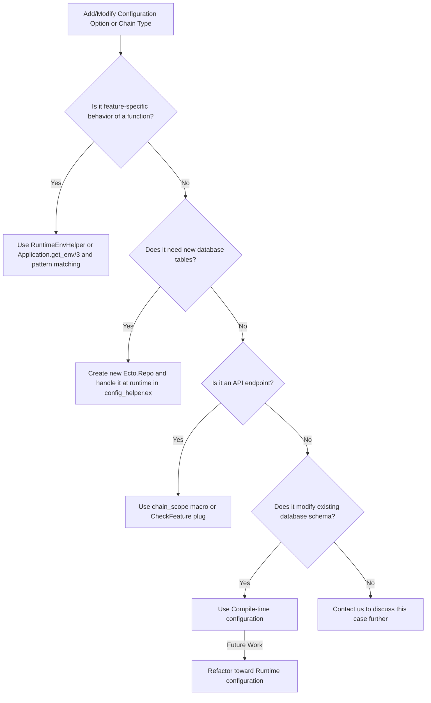

# Contribution Guidelines: What We Are Looking For

We welcome contributions that enhance the project and improve the overall quality of our codebase. While we appreciate the effort that goes into making contributions, we kindly ask that contributors focus on the following types of changes:
- Feature Enhancements: Substantial improvements or new features that add significant value to the project.
- Bug Fixes: Fixes for known bugs or issues that impact functionality.
- Documentation Improvements: Comprehensive updates to documentation that clarify usage, installation, or project structure.
- Performance Improvements: Changes that enhance the performance or efficiency of the application.

# Contributing

1. Fork it ( <https://github.com/blockscout/blockscout/fork> )
2. Create your feature branch (`git checkout -b my-new-feature`)
3. Write tests that cover your work
4. Commit your changes (`git commit -am 'Add some feature'`)
5. Push to the branch (`git push origin my-new-feature`)
6. Create a new Pull Request. The title of Pull Request should follow [Conventional Commits specification](https://www.conventionalcommits.org/en/v1.0.0/) and should start with `feat:`, `fix:`, `chore:`, `doc:`, `perf:`, `refactor:` prefix.

## General

* Commits should be one logical change that still allows all tests to pass.  Prefer smaller commits if there could be two levels of logic grouping.  The goal is to allow contributors in the future (including your own future self) to determine your reasoning for making changes and to allow them to cherry-pick, patch or port those changes in isolation to other branches or forks.
* If during your PR you reveal a pre-existing bug:
  1. Try to isolate the bug and fix it on an independent branch and PR it first.
  2. Try to fix the bug in a separate commit from other changes:
     1. Commit the code in the broken state that revealed the bug originally
     2. Commit the fix for the bug.
     3. Continue original PR work.

## Enhancements

Enhancements cover all changes that make users lives better:

* [feature requests filed as issues](https://github.com/blockscout/blockscout/labels/enhancement) that impact end-user [contributors](https://github.com/blockscout/blockscout/labels/contributor) and [developers](https://github.com/blockscout/blockscout/labels/developer)
* changes to the [architecture](https://github.com/blockscout/blockscout/labels/architecture) that make it easier for contributors (in the GitHub sense), dev-ops, and deployers to maintain and run blockscout

## Bug Fixes

For bug fixes, whenever possible, there should be at least 2 commits:

1. A regression test commit that contains tests that demonstrate the bug and show as failing.
2. The bug fix commit that shows the regression test now passing.

This format ensures that we can run the test to reproduce the original bug without depending on the new code in the fix, which could lead to the test falsely passing.

## Incompatible Changes

Incompatible changes can arise as a side-effect of either Enhancements or Bug Fixes.  During Enhancements, incompatible changes can occur because, as an example, in order to support showing end-users new data, the database schema may need to be changed and the index rebuilt from scratch.  During bug fixes, incompatible changes can occur because in order to fix a bug, the schema had to change, or how certain internal APIs are called changed.

* Incompatible changes should be called out explicitly, with any steps the various user roles need to do to upgrade.
* If a schema change occurs that requires a re-index add the following to the Pull Request description:

  ```markdown
  **NOTE**: A database reset and re-index is required
  ```

## Pull Request

There is a [PULL_REQUEST_TEMPLATE.md](PULL_REQUEST_TEMPLATE.md) for this repository, but since it can't fill in the title for you, please follow the following steps when opening a Pull Request before filling in the template:

* [ ] Title
  * [ ] Prefix labels if you don't have permissions to set labels in the GitHub interface.
  * (bug) for [bug](https://github.com/blockscout/blockscout/labels/bug) fixes
  * (enhancement) for [enhancement](https://github.com/blockscout/blockscout/labels/enhancement)s
  * (incompatible changes) for [incompatible changes](https://github.com/blockscout/blockscout/labels/incompatible%20changes), such a refactor that removes functionality, changes arguments, or makes something required that wasn't previously.
  * [ ] Single sentence summary of change
    * What was fixed for bugs
    * What was added for enhancements
    * What was changed for incompatible changes

See [#255](https://github.com/blockscout/blockscout/pull/255) as an example PR that uses GitHub keywords and a Changelog to explain multiple changes.

## Basic Naming Convention

When contributing to the codebase, please adhere to the following naming conventions to ensure clarity and consistency:

- Use full names for entities. Avoid abbreviations or shorthand.
  - Instead of "tx" or "txn", use "transaction".
  - Instead of "txs", use "transactions".
  - Instead of "tx_hash" or "txn_hash", use "transaction_hash".
  - Instead of "address", use "address_hash".
  - Instead of "block_num", use "block_number".
- Ensure that variable names are descriptive and convey the purpose or content clearly.
- Consistent naming helps in maintaining readability and understanding of the code, especially for new contributors.

By following these conventions, we can maintain a clean and understandable codebase.

### API V2 Naming Convention

When contributing to the API v2, please adhere to the following naming conventions for response fields to ensure clarity and consistency:

- The block number should be returned as a number in the property with the name which ends with `block_number`.
- All hashes (transaction, block address etc.) should be returned as a hex string in the property which ends with `_hash`.
- Property name for aggregations like counts and sums should contain plural form of entity and `_count`, `_sum` suffix respecively, e.g. `transactions_count`, `blocks_count`, `withdrawals_sum`.
- All fields that contain the "index" suffix should be returned as numbers.

## Environment Configuration Best Practices

### Runtime vs. Compile-time Configuration

We strongly favor **runtime configuration** over compile-time configuration
whenever possible. This approach:

- Reduces the number of Docker images needed
- Increases deployment flexibility
- Simplifies maintenance and testing

When **adding** new configuration options, chain types, or **refactoring**
existing ones, please follow the decision tree below to determine the
appropriate approach:



#### Use runtime configuration and pattern matching

Anti-pattern:

```elixir
# AVOID THIS
use Utils.CompileTimeEnvHelper,
  chain_type: [:explorer, :chain_type]

if @chain_type == :optimism do
  def foo, do: :bar
else
  def foo, do: :baz
end
```

Better approach:

```elixir
# DO THIS INSTEAD
use Utils.RuntimeEnvHelper,
  chain_type: [:explorer, :chain_type]

def foo, do: chain_type() |> do_foo()

defp do_foo(:optimism), do: :bar
defp do_foo(_), do: :baz
```

#### New database tables

If your feature or chain-specific functionality requires new database tables:

1. Define a new repository module in `apps/explorer/lib/explorer/repo.ex`.
2. Add the repository to `config/config_helper.exs` in the `repos/0` function.
3. Include a runtime check to load this repo conditionally:

```elixir
# In config_helper.ex
ext_repos = [
  {parse_bool_env_var("MY_FEATURE_ENABLED"), Explorer.Repo.MyFeature},
  # other feature repos...
]
|> Enum.filter(&elem(&1, 0))
|> Enum.map(&elem(&1, 1))
```

This approach ensures migrations are automatically detected and applied at
runtime without requiring recompilation.

#### API endpoints

For feature-specific or chain-specific API endpoints, use one of the following
runtime approaches:

1. **For chain-specific routes**, use the `chain_scope` macro in your router:

```elixir
scope "/v2", as: :api_v2 do
  chain_scope :polygon_zkevm do
    get("/zkevm-batch/:batch_number", V2.TransactionController, :polygon_zkevm_batch)
  end
end
```

2. **For feature-toggle endpoints**, use `CheckFeature` plug in pipelines:

```elixir
pipeline :my_feature do
  plug(BlockScoutWeb.Plug.CheckFeature, feature_check: &my_feature_enabled?/0)
end

scope "/my-feature" do
  pipe_through(:my_feature)
  
  get "/data", MyFeatureController, :index
end
```

Both approaches return appropriate 404 responses when the feature is disabled or
chain type doesn't match.

#### Modifying existing database schema

If your functionality requires modifying existing database schema structures
(adding columns to shared tables, changing constraints, etc.), you currently
must use compile-time configuration. This is the **only case** where
compile-time configuration is still recommended.

```elixir
# Current approach for schema modifications
use Utils.CompileTimeEnvHelper,
  chain_type: [:explorer, :chain_type]

if @chain_type == :optimism do
  # Schema modifications specific to Optimism
end
```

To prepare for future runtime refactoring, isolate these schema-specific changes
as much as possible.

This limitation stems from Ecto schemas being defined at compile-time. When
different chain types need variations in shared tables (additional fields,
different constraints), these schema differences cannot be modified at runtime.
We're currently researching approaches for dynamic schema adjustment based on
runtime configuration.

For reference on which chain types still require compile-time configuration, see
the [Chain-Specific Environment
Variables](https://docs.blockscout.com/setup/env-variables/backend-envs-chain-specific)
documentation.

### Compile time Environment Variables

Before using compile-time configuration, ensure you've exhausted all runtime
alternatives by following the decision tree above. If after careful
consideration you still need to work with compile-time environment variables,
follow these guidelines:

- Always use the `Utils.CompileTimeEnvHelper` module instead of direct
  `Application.compile_env/2` calls:

```elixir
# DO use this approach
use Utils.CompileTimeEnvHelper,
    attribute_name: [:app, :test]

# Access the value using the module attribute
@attribute_name

# DON'T use this approach
Application.compile_env(:app, :test)  # avoid direct compile_env calls
```

This approach provides faster compilation time and simplifies development and
maintenance.
