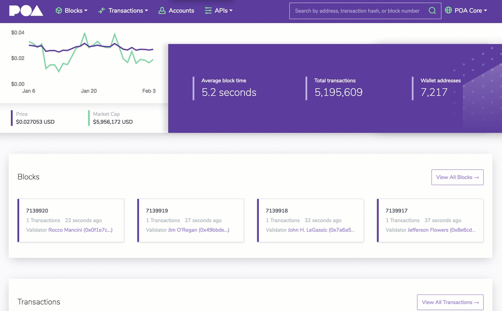

<p align="center">
  <a href="https://blockscout.com">
    
  </a>
</p>

<h1 align="center">BlockScout</h1>
<p align="center">Blockchain Explorer for inspecting and analyzing EVM Chains.</p>
<div align="center">

[](https://circleci.com/gh/poanetwork/blockscout) [](https://coveralls.io/github/poanetwork/blockscout?branch=master) [](https://gitter.im/poanetwork/blockscout?utm_source=badge&utm_medium=badge&utm_campaign=pr-badge&utm_content=badge)

</div>

BlockScout provides a comprehensive, easy-to-use interface for users to view, confirm, and inspect transactions on **all EVM** (Ethereum Virtual Machine) blockchains. This includes the Ethereum main and test networks as well as **Ethereum forks and sidechains**.

Following is an overview of the project and instructions for [getting started](#getting-started).

Visit the [POA BlockScout forum](https://forum.poa.network/c/blockscout) or the [Gitter Channel](https://gitter.im/poanetwork/blockscout) to access additional information or post questions.

## About BlockScout

BlockScout is an Elixir application that allows users to search transactions, view accounts and balances, and verify smart contracts on the entire Ethereum network including all forks and sidechains.

Currently available block explorers (i.e. Etherscan and Etherchain) are closed systems which are not independently verifiable.  As Ethereum sidechains continue to proliferate in both private and public settings, transparent tools are needed to analyze and validate transactions.


### Features

- [x] **Open source development**: The code is community driven and available for anyone to use, explore and improve.

- [x] **Real time transaction tracking**: Transactions are updated in real time - no page refresh required. Infinite scrolling is also enabled.

- [x] **Smart contract interaction**: Users can read and verify Solidity smart contracts and access pre-existing contracts to fast-track development. Support for Vyper, LLL, and Web Assembly contracts is in progress.

- [x] **Token support**: ERC20 and ERC721 tokens are supported. Future releases will support additional token types including ERC223 and ERC1155.

- [x] **User customization**: Users can easily deploy on a network and customize the Bootstrap interface.

- [x] **Ethereum sidechain networks**: BlockScout supports the Ethereum mainnet, Ethereum testnets, POA network, and forks like Ethereum Classic, xDAI, additional sidechains, and private EVM networks.

### Supported Projects

#### Hosted Chains

* [POA Core Network](https://blockscout.com/poa/core)
* [POA Sokol Testnet](https://blockscout.com/poa/sokol)
* [xDai Chain](https://blockscout.com/poa/dai)
* [Ethereum Mainnet](https://blockscout.com/eth/mainnet)
* [Kovan Testnet](https://blockscout.com/eth/kovan)
* [Ropsten Testnet](https://blockscout.com/eth/ropsten)
* [Goerli Testnet](https://blockscout.com/eth/goerli)
* [Rinkeby Testnet](https://blockscout.com/eth/rinkeby)
* [Ethereum Classic](https://blockscout.com/etc/mainnet)

#### Additional Chains Utilizing BlockScout

* [Oasis Labs](https://blockexplorer.oasiscloud.io/)
* [Fuse Network](https://explorer.fuse.io/)
* [ARTIS](https://explorer.sigma1.artis.network)
* [SafeChain](https://explorer.safechain.io)
* [SpringChain](https://explorer.springrole.com/)

### Visual Interface

Interface for the POA network _updated 02/2019_



## Getting Started

We use [Terraform](https://www.terraform.io/intro/getting-started/install.html) to build the correct infrastructure to run BlockScout. See [https://github.com/poanetwork/blockscout-terraform](https://github.com/poanetwork/blockscout-terraform) for details.

### Requirements

The [development stack page](https://github.com/poanetwork/blockscout/wiki/Development-Stack) contains more information about these frameworks.

| Dependency  | Mac | Linux |
|-------------|-----|-------|
| [Erlang/OTP 21.0.4](https://github.com/erlang/otp) | `brew install erlang` | [Erlang Install Example](https://github.com/poanetwork/blockscout-terraform/blob/33f68e816e36dc2fb055911fa0372531f0e956e7/modules/stack/libexec/init.sh#L134) |
| [Elixir 1.8.1](https://elixir-lang.org/) | :point_up: | [Elixir Install Example](https://github.com/poanetwork/blockscout-terraform/blob/33f68e816e36dc2fb055911fa0372531f0e956e7/modules/stack/libexec/init.sh#L138) |
| [Postgres 10.3](https://www.postgresql.org/) | `brew install postgresql` | [Postgres Install Example](https://github.com/poanetwork/blockscout-terraform/blob/33f68e816e36dc2fb055911fa0372531f0e956e7/modules/stack/libexec/init.sh#L187) |
| [Node.js 10.5.0](https://nodejs.org/en/) | `brew install node` | [Node.js Install Example](https://github.com/poanetwork/blockscout-terraform/blob/33f68e816e36dc2fb055911fa0372531f0e956e7/modules/stack/libexec/init.sh#L66) |
| [Automake](https://www.gnu.org/software/automake/) | `brew install automake` | [Automake Install Example](https://github.com/poanetwork/blockscout-terraform/blob/33f68e816e36dc2fb055911fa0372531f0e956e7/modules/stack/libexec/init.sh#L72) |
| [Libtool](https://www.gnu.org/software/libtool/) | `brew install libtool` | [Libtool Install Example](https://github.com/poanetwork/blockscout-terraform/blob/33f68e816e36dc2fb055911fa0372531f0e956e7/modules/stack/libexec/init.sh#L62) |
| [Inotify-tools](https://github.com/rvoicilas/inotify-tools/wiki) | Not Required | Ubuntu - `apt-get install inotify-tools` |
| [GCC Compiler](https://gcc.gnu.org/) | `brew install gcc` | [GCC Compiler Example](https://github.com/poanetwork/blockscout-terraform/blob/33f68e816e36dc2fb055911fa0372531f0e956e7/modules/stack/libexec/init.sh#L70) |
| [GMP](https://gmplib.org/) | `brew install gmp` | [Install GMP Devel](https://github.com/poanetwork/blockscout-terraform/blob/33f68e816e36dc2fb055911fa0372531f0e956e7/modules/stack/libexec/init.sh#L74) |

### Build and Run

  1. Clone the repository.
  `git clone https://github.com/poanetwork/blockscout`

  2. Go to the explorer subdirectory.
  `cd blockscout`

  3. Set up default configurations.
  `cp apps/explorer/config/dev.secret.exs.example apps/explorer/config/dev.secret.exs`
  `cp apps/block_scout_web/config/dev.secret.exs.example apps/block_scout_web/config/dev.secret.exs`
  <br />Linux: Update the database username and password configuration in `apps/explorer/config/dev.secret.exs`
  <br />Mac: Remove the `username` and `password` fields from `apps/explorer/config/dev.secret.exs`
  <br />Optional: Set up default configuration for testing.
  `cp apps/explorer/config/test.secret.exs.example apps/explorer/config/test.secret.exs`
  Example usage: Changing the default Postgres port from localhost:15432 if [Boxen](https://github.com/boxen/boxen) is installed.

  4. Install dependencies.
  `mix do deps.get, local.rebar --force, deps.compile, compile`

  5. Create and migrate database.
  `mix ecto.create && mix ecto.migrate`
  <br />_Note:_ If you have run previously, drop the previous database
  `mix do ecto.drop, ecto.create, ecto.migrate`

  6. Install Node.js dependencies.
  `cd apps/block_scout_web/assets && npm install; cd -`
  `cd apps/explorer && npm install; cd -`

  7. Update your JSON RPC Variant in `apps/explorer/config/dev.exs` and `apps/indexer/config/dev.exs`.
  For `variant`, enter `ganache`, `geth`, or `parity`

  8. Update your JSON RPC Endpoint in `apps/explorer/config/dev/` and `apps/indexer/config/dev/`
  For the `variant` chosen in step 7, enter the correct information for the corresponding JSON RPC Endpoint in `parity.exs`, `geth.exs`, or `ganache.exs`

  9. Enable HTTPS in development. The Phoenix server only runs with HTTPS.
     * `cd apps/block_scout_web`
     * `mix phx.gen.cert blockscout blockscout.local; cd -`
     * Add blockscout and blockscout.local to your `/etc/hosts`
     ```
        127.0.0.1       localhost blockscout blockscout.local
        255.255.255.255 broadcasthost
        ::1             localhost blockscout blockscout.local
      ```
      * If using Chrome, Enable `chrome://flags/#allow-insecure-localhost`.

  9. Start Phoenix Server.
  `mix phx.server`

Now you can visit [`localhost:4000`](http://localhost:4000) from your browser.

_Additional runtime options:_

*  Run Phoenix Server with IEx (Interactive Elixer)
`iex -S mix phx.server`

*  Run Phoenix Server with real time indexer
`iex -S mix phx.server`

### Automating Restarts

By default `blockscout` does not restart if it crashes. To enable automated
restarts, set the environment variable `HEART_COMMAND` to whatever you run to
start `blockscout`. You can configure the heart beat timeout, which will change
how long it will wait before considering the application to be unresponsive. At
that point, it will kill the current blockscout and execute `HEART_COMMAND`.
By default a crash dump is not written unless you set `ERL_CRASH_DUMP_SECONDS`
to a positive or negative integer. See the documentation for
[heart](http://erlang.org/doc/man/heart.html) for more information.


### Configuring Ethereum Classic and other EVM Chains
**Note: Most of these modifications will be consolidated into a single file in the future.**

  1. Update the import file in `apps/block_scout_web/assets/css/theme/_variables.scss`. There are several preset css files for our supported chains which include Ethereum Classic, Ethereum Mainnet, Ropsten Testnet, Kovan Testnet, POA Core, and POA Sokol. To deploy Ethereum Classic, change the import to `ethereum_classic_variables`.

  2. Update the logo file in `apps/block_scout_web/config/config.exs`. To deploy Ethereum Classic, change this file to `classic_ethereum_logo.svg`.

  3. Update the `check_origin` configuration in `apps/block_scout_web/config/prod.exs`. This allows realtime events to occur on your endpoint.

  4. Update the node configuration. You will need a full tracing node with WebSockets enabled. Make the changes in the following files (dev/prod):

   * `apps/explorer/config/dev/parity.exs`
   * `apps/explorer/config/prod/parity.exs`
   * `apps/indexer/config/dev/parity.exs`
   * `apps/indexer/config/prod/parity.exs`

  5. Update the dropdown menu in the main navigation `apps/block_scout_web/lib/block_scout_web/templates/layout/_topnav.html.eex`

  6. Update the coin in `apps/explorer/config/config.exs`. This will pull relevant information from Coinmarketcap.com.

### Umbrella Project Organization

This repository is an [umbrella project](https://elixir-lang.org/getting-started/mix-otp/dependencies-and-umbrella-projects.html). Each directory under `apps/` is a separate [Mix](https://hexdocs.pm/mix/Mix.html) project and [OTP application](https://hexdocs.pm/elixir/Application.html), but the projects can use each other as a dependency in their `mix.exs`.

Each OTP application has a restricted domain.

| Directory               | OTP Application     | Namespace         | Purpose                                                                                                                                                                                                                                                                                                                                                                         |
|:------------------------|:--------------------|:------------------|:--------------------------------------------------------------------------------------------------------------------------------------------------------------------------------------------------------------------------------------------------------------------------------------------------------------------------------------------------------------------------------|
| `apps/ethereum_jsonrpc` | `:ethereum_jsonrpc` | `EthereumJSONRPC` | Ethereum JSONRPC client.  It is allowed to know `Explorer`'s param format, but it cannot directly depend on `:explorer`                                                                                                                                                                                                                                                         |
| `apps/explorer`         | `:explorer`         | `Explorer`        | Storage for the indexed chain.  Can read and write to the backing storage.  MUST be able to boot in a read-only mode when run independently from `:indexer`, so cannot depend on `:indexer` as that would start `:indexer` indexing.                                                                                                                                            |
| `apps/block_scout_web`     | `:block_scout_web`     | `BlockScoutWeb`     | Phoenix interface to `:explorer`.  The minimum interface to allow web access should go in `:block_scout_web`.  Any business rules or interface not tied directly to `Phoenix` or `Plug` should go in `:explorer`. MUST be able to boot in a read-only mode when run independently from `:indexer`, so cannot depend on `:indexer` as that would start `:indexer` indexing. |
| `apps/indexer`          | `:indexer`          | `Indexer`         | Uses `:ethereum_jsonrpc` to index chain and batch import data into `:explorer`.  Any process, `Task`, or `GenServer` that automatically reads from the chain and writes to `:explorer` should be in `:indexer`. This restricts automatic writes to `:indexer` and read-only mode can be achieved by not running `:indexer`.                                             |


### CircleCI Updates

To monitor build status, configure your local [CCMenu](http://ccmenu.org/) with the following url: [`https://circleci.com/gh/poanetwork/blockscout.cc.xml?circle-token=f8823a3d0090407c11f87028c73015a331dbf604`](https://circleci.com/gh/poanetwork/blockscout.cc.xml?circle-token=f8823a3d0090407c11f87028c73015a331dbf604)


### Testing

#### Requirements

  * PhantomJS (for wallaby)

#### Running the tests

  1. Build the assets.
  `cd apps/block_scout_web/assets && npm run build; cd -`

  2. Format the Elixir code.
  `mix format`

  3. Run the test suite with coverage for whole umbrella project.  This step can be run with different configuration outlined below.
  `mix coveralls.html --umbrella`

  4. Lint the Elixir code.
  `mix credo --strict`

  5. Run the dialyzer.
  `mix dialyzer --halt-exit-status`

  6. Check the Elixir code for vulnerabilities.
  `cd apps/explorer && mix sobelow --config; cd -`
  `cd apps/block_scout_web && mix sobelow --config; cd -`

  7. Lint the JavaScript code.
  `cd apps/block_scout_web/assets && npm run eslint; cd -`

  8. Test the JavaScript code.
  `cd apps/block_scout_web/assets && npm run test; cd -`

##### Parity

###### Mox

**This is the default setup.  `mix coveralls.html --umbrella` will work on its own, but to be explicit, use the following setup**:

```shell
export ETHEREUM_JSONRPC_CASE=EthereumJSONRPC.Case.Parity.Mox
export ETHEREUM_JSONRPC_WEB_SOCKET_CASE=EthereumJSONRPC.WebSocket.Case.Mox
mix coveralls.html --umbrella --exclude no_parity
```

###### HTTP / WebSocket

```shell
export ETHEREUM_JSONRPC_CASE=EthereumJSONRPC.Case.Parity.HTTPWebSocket
export ETHEREUM_JSONRPC_WEB_SOCKET_CASE=EthereumJSONRPC.WebSocket.Case.Parity
mix coveralls.html --umbrella --exclude no_parity
```

| Protocol  | URL                                |
|:----------|:-----------------------------------|
| HTTP      | `http://localhost:8545`  |
| WebSocket | `ws://localhost:8546`    |

##### Geth

###### Mox

```shell
export ETHEREUM_JSONRPC_CASE=EthereumJSONRPC.Case.Geth.Mox
export ETHEREUM_JSONRPC_WEB_SOCKET_CASE=EthereumJSONRPC.WebSocket.Case.Mox
mix coveralls.html --umbrella --exclude no_geth
```

###### HTTP / WebSocket

```shell
export ETHEREUM_JSONRPC_CASE=EthereumJSONRPC.Case.Geth.HTTPWebSocket
export ETHEREUM_JSONRPC_WEB_SOCKET_CASE=EthereumJSONRPC.WebSocket.Case.Geth
mix coveralls.html --umbrella --exclude no_geth
```

| Protocol  | URL                                               |
|:----------|:--------------------------------------------------|
| HTTP      | `https://mainnet.infura.io/8lTvJTKmHPCHazkneJsY`  |
| WebSocket | `wss://mainnet.infura.io/ws/8lTvJTKmHPCHazkneJsY` |

### API Documentation

To view Modules and API Reference documentation:

1. Generate documentation.
`mix docs`
2. View the generated docs.
`open doc/index.html`

## Front-end

### Javascript

All Javascript files are under [apps/block_scout_web/assets/js](https://github.com/poanetwork/blockscout/tree/master/apps/block_scout_web/assets/js) and the main file is [app.js](https://github.com/poanetwork/blockscout/blob/master/apps/block_scout_web/assets/js/app.js). This file imports all javascript used in the application. If you want to create a new JS file consider creating into [/js/pages](https://github.com/poanetwork/blockscout/tree/master/apps/block_scout_web/assets/js/pages) or [/js/lib](https://github.com/poanetwork/blockscout/tree/master/apps/block_scout_web/assets/js/lib), as follows:

#### js/lib
This folder contains all scripts that can be reused in any page or can be used as a helper to some component.

#### js/pages
This folder contains the scripts that are specific for some page.

#### Redux
This project uses Redux to control the state in some pages. There are pages that have things happening in real-time thanks to the Phoenix channels, e.g. Address page, so the page state changes a lot depending on which events it is listening. The redux is also used to load some contents asynchronous, see [async_listing_load.js](https://github.com/poanetwork/blockscout/blob/master/apps/block_scout_web/assets/js/lib/async_listing_load.js).

To understand how to build new pages that need redux in this project, see the [redux_helpers.js](https://github.com/poanetwork/blockscout/blob/master/apps/block_scout_web/assets/js/lib/redux_helpers.js)

## Internationalization

The app is currently internationalized. It is only localized to U.S. English. To translate new strings.

1. To setup translation file.
`cd apps/block_scout_web; mix gettext.extract --merge; cd -`
2. To edit the new strings, go to `apps/block_scout_web/priv/gettext/en/LC_MESSAGES/default.po`.

## Metrics

BlockScout is setup to export [Prometheus](https://prometheus.io/) metrics at `/metrics`.

### Prometheus

1. Install prometheus: `brew install prometheus`
2. Start the web server `iex -S mix phx.server`
3. Start prometheus: `prometheus --config.file=prometheus.yml`

### Grafana

1. Install grafana: `brew install grafana`
2. Install Pie Chart panel plugin: `grafana-cli plugins install grafana-piechart-panel`
3. Start grafana: `brew services start grafana`
4. Add Prometheus as a Data Source
   1. `open http://localhost:3000/datasources`
   2. Click "+ Add data source"
   3. Put "Prometheus" for "Name"
   4. Change "Type" to "Prometheus"
   5. Set "URL" to "http://localhost:9090"
   6. Set "Scrape Interval" to "10s"
5. Add the dashboards from https://github.com/deadtrickster/beam-dashboards:
   For each `*.json` file in the repo.
   1. `open http://localhost:3000/dashboard/import`
   2. Copy the contents of the JSON file in the "Or paste JSON" entry
   3. Click "Load"
6. View the dashboards.  (You will need to click-around and use BlockScout for the web-related metrics to show up.)

## Tracing

Blockscout supports tracing via
[Spandex](http://git@github.com:spandex-project/spandex.git). Each application
has its own tracer, that is configured internally to that application. In order
to enable it, visit each application's `config/<env>.ex` and update its tracer
configuration to change `disabled?: true` to `disabled?: false`. Do this for
each application you'd like included in your trace data.

Currently, only [Datadog](https://www.datadoghq.com/) is supported as a
tracing backend, but more will be added soon.

### DataDog

If you would like to use DataDog, after enabling `Spandex`, set
`"DATADOG_HOST"` and `"DATADOG_PORT"` environment variables to the
host/port that your Datadog agent is running on. For more information on
Datadog and the Datadog agent, see their
[documentation](https://docs.datadoghq.com/).

### Other

If you want to use a different  backend, remove the
`SpandexDatadog.ApiServer` `Supervisor.child_spec` from
`Explorer.Application` and follow any instructions provided in `Spandex`
for setting up that backend.

## Memory Usage

The work queues for building the index of all blocks, balances (coin and token), and internal transactions can grow quite large.   By default, the soft-limit is 1 GiB, which can be changed in `apps/indexer/config/config.exs`:

```
config :indexer, memory_limit: 1 <<< 30
```

Memory usage is checked once per minute.  If the soft-limit is reached, the shrinkable work queues will shed half their load.  The shed load will be restored from the database, the same as when a restart of the server occurs, so rebuilding the work queue will be slower, but use less memory.

If all queues are at their minimum size, then no more memory can be reclaimed and an error will be logged.

## Acknowledgements

We would like to thank the [EthPrize foundation](http://ethprize.io/) for their funding support.

## Contributing

See [CONTRIBUTING.md](CONTRIBUTING.md) for contribution and pull request protocol. We expect contributors to follow our [code of conduct](CODE_OF_CONDUCT.md) when submitting code or comments.


## License

[](https://www.gnu.org/licenses/gpl-3.0)

This project is licensed under the GNU General Public License v3.0. See the [LICENSE](LICENSE) file for details.
