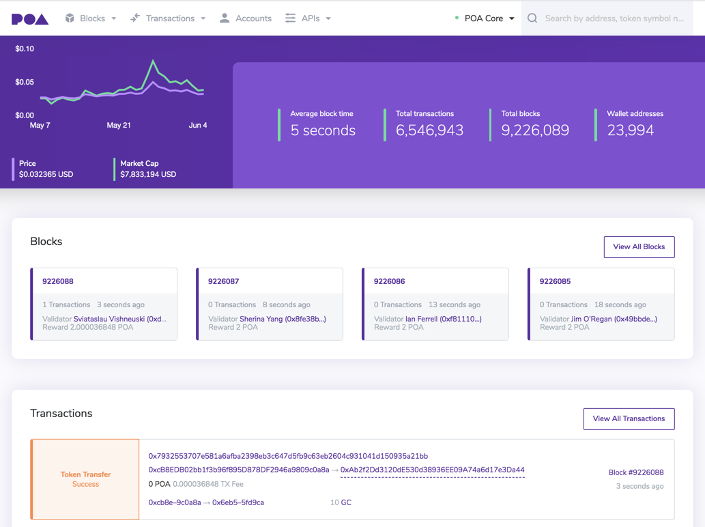

<!-- about.md -->

## About BlockScout

BlockScout is an Elixir application that allows users to search transactions, view accounts and balances, and verify smart contracts on the entire Ethereum network including all forks and sidechains.

Currently available block explorers (i.e. Etherscan and Etherchain) are closed systems which are not independently verifiable.  As Ethereum sidechains continue to proliferate in both private and public settings, transparent tools are needed to analyze and validate transactions.

Information on the latest release and version history is available [on our forum](https://forum.poa.network/c/blockscout/releases)

## Visual Interface

Interface for the POA network: v2.0 _updated 06/2019_

## Acknowledgements

We would like to thank the [EthPrize foundation](http://ethprize.io/) for their funding support.

## Contributing

See [CONTRIBUTING.md](https://github.com/poanetwork/blockscout/blob/master/CONTRIBUTING.md) for contribution and pull request protocol. We expect contributors to follow our [code of conduct](https://github.com/poanetwork/blockscout/blob/master/CODE_OF_CONDUCT.md) when submitting code or comments.

## License

This project is licensed under the GNU General Public License v3.0. See the [LICENSE](https://github.com/poanetwork/blockscout/blob/master/LICENSE) file for details.

