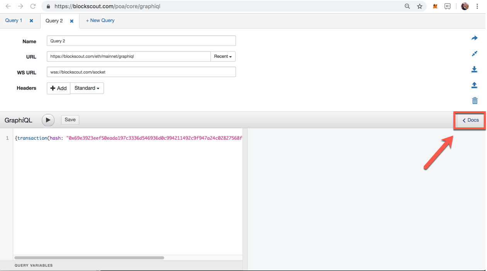

<!--api.md -->

## BlockScout Internal Documentation

To view Modules and API Reference documentation:

1. Generate documentation.
`mix docs`
2. View the generated docs.
`open doc/index.html`

## BlockScout API Usage

Api calls can be accessed from the BlockScout UI menu. BlockScout supports several methods:

1. [Graphiql](https://github.com/graphql/graphiql): An IDE for exploring GraphQL
2. RPC: API provided for developers transitioning their applications from Etherscan to BlockScout. It supports GET and POST requests.

### Graphiql

Send Queries to quickly get information. Use the Docs button to quickly find arguments accepted by the schema.More information is available in our [BlockScout GraphQL tutorial](https://forum.poa.network/t/graphql-in-blockscout/1971).

#### Graphiql RootQueryType Fields

* address(hash: AddressHash!): Address 
Gets an address by hash.
  
* addresses(hashes: [AddressHash!]!): [Address] 
Gets addresses by address hash.
  
* block(number: Int!): Block 
Gets a block by number.
  
* node(id: ID!): Node 
Fetches an object given its ID
  
* tokenTransfers( 
after: String 
before: String 
count: Int 
first: Int 
last: Int 
tokenContractAddressHash: AddressHash! 
): TokenTransferConnection 
Gets token transfers by token contract address hash.
  
* transaction(hash: FullHash!): Transaction 
Gets a transaction by hash.

#### Example Queries

Blockscout's GraphQL API provides 4 queries and 1 subscription. You can view them in GraphiQL interface under the `Schema` tab. Short query examples:

| Query                                         | Description                 | Example                                                                                                                                  |
|-----------------------------------------------|-----------------------------|------------------------------------------------------------------------------------------------------------------------------------------|
| address(hash: AddressHash!):  Address         | Gets an address by hash     | {address(hash: "0x1fddEc96688e0538A316C64dcFd211c491ECf0d8") {hash, contractCode} }                                                      |
| addresses (hashes: [AddressHash!]): [Address] | Gets addresses by hashes    | {addresses(hashes: ["0x1fddEc96688e0538A316C64dcFd211c491ECf0d8",  "0x3948c17c0f45017064858b8352580267a85a762c"]) {hash, contractCode} } |
| block(number: Int!): Block                    | Gets a block by number      | {block(number: 1) {parentHash, size, nonce}}                                                                                             |
| transaction (hash: FullHash!): Transaction    | Gets a transaction by hash. | {transaction(hash: "0xc391da8f433b3bea0b3eb45da40fdd194c7a0e07d1b5ad656bf98940f80a6cf6") {input, gasUsed}}                               |

[Example GraphQL Query to retrieve transactions for a specific address](https://forum.poa.network/t/faq-graphql-query-to-retrieve-transactions-for-a-specific-address/1937)

