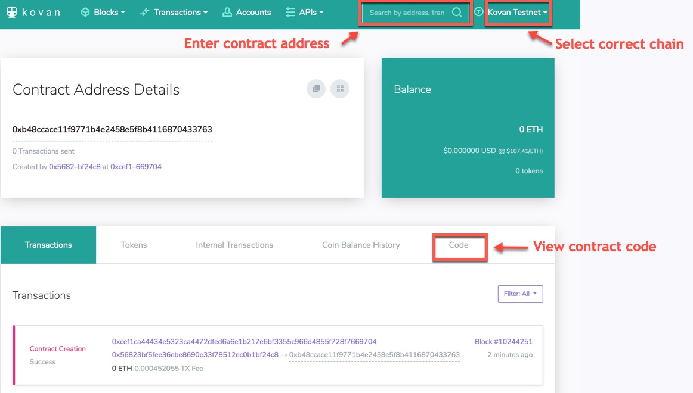
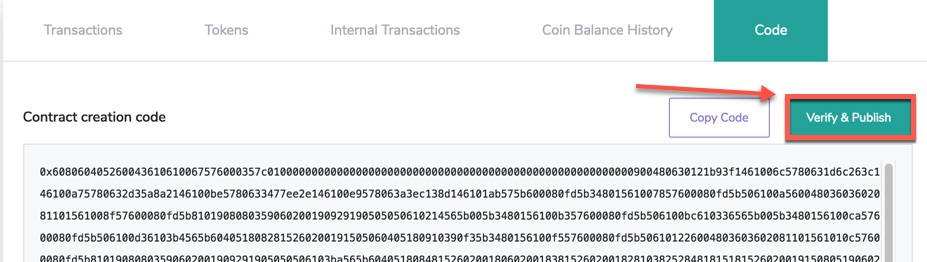
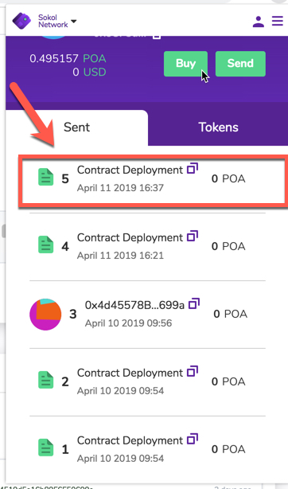
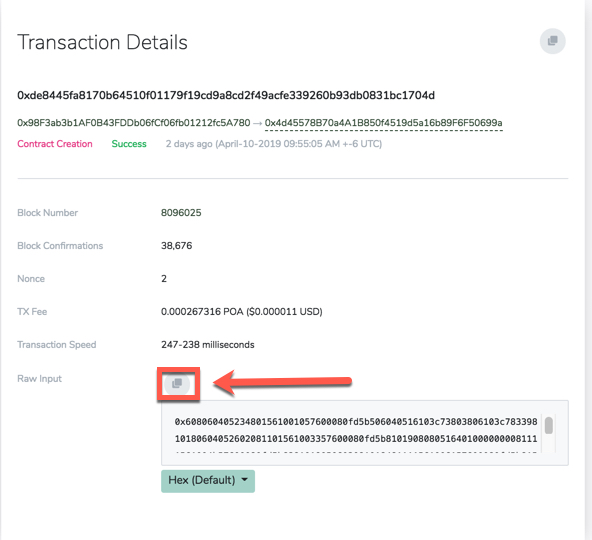
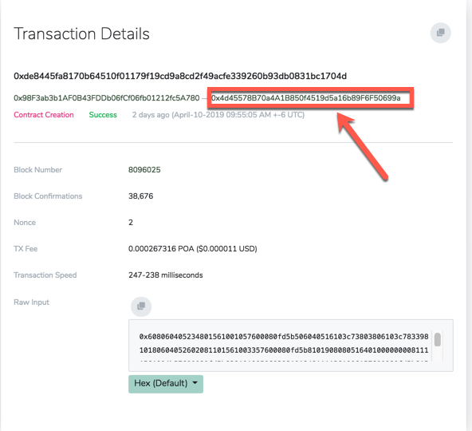
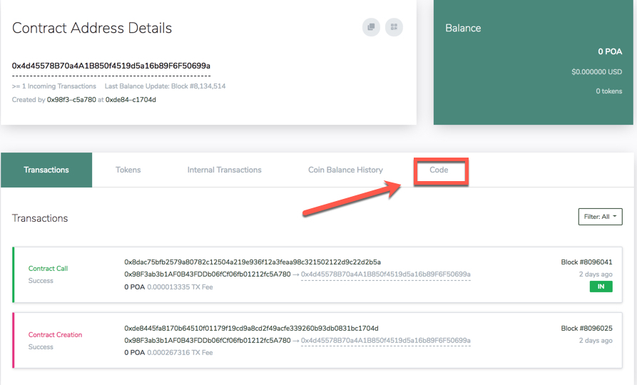
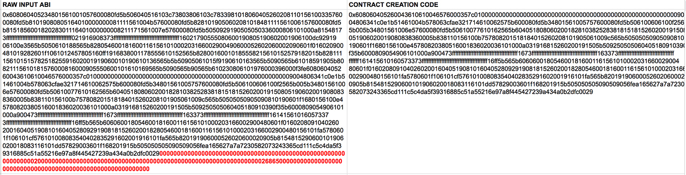

<!-- smart-contract.md -->

# Verifying a smart contract in BlockScout

Once verified, a smart contract or token contract's source code becomes publicly available and verifiable. This creates transparency and trust. Plus, it's easy to do!

1. Go to [blockscout.com](https://blockscout.com/), verify you are on the chain where the contract was deployed, and type the contract's address into the search bar. Your contract details should come up.

2. Select the `Code` tab  to view the bytecode.

 

3. In the code tab view, click the `Verify & Publish` button. 

 

4. On the following screen, enter your contract details:
   1. **Contract Address:** The `0x` address supplied on contract creation. 
   2. **Contract Name:** Name of the class whose constructor was called in the .sol file.  For example, in `contract MyContract {..`  **MyContract** is the contract name.
   3. **Compiler:** derived from the first line in the contract   `pragma solidity X.X.X`. Use the corresponding compiler version rather than the nightly build.
   4. **EVM Version:** [See EVM version](#evm-version)
   5. **Optimization:** If you enabled optimization during compilation, check yes.
   6. **Enter the Solidity Contract Code:** You may need to flatten your solidity code if it utilizes a library or inherits dependencies from another contract. We recommend the [POA solidity flattener](https://github.com/poanetwork/solidity-flattener) or the [truffle flattener](https://www.npmjs.com/package/truffle-flattener)
   7.**Constructor Arguments:** [See this post for more info](https://forum.poa.network/t/smart-contract-verification-abi-encoded-constructor-arguments/2331)
   8.**Libraries:** Enter the name and Ox address for any required libraries called in the called in the .sol file.
   9. Click the `Verify and Publish` button.
   
 5. If all goes well, you will see a green checkmark next to the code, and an additional tab where you can read the contract. In addition, the contract name will appear in BlockScout with any transactions related to your contract.
 
## Troubleshooting:

If you receive the dreaded `There was an error compiling your contract` message this means the bytecode doesn't match the supplied sourcecode. Unfortunately, there are many reasons this may be the case. Here are a few things to try:

1. Double check the compiler version is correct.

2. Check that an extra space has not been added to the end of the contract. When pasting in, an extra space may be added. Delete this and attempt to recompile.

3. Copy, paste and verify your source code in Remix. You may find some exceptions here.

# EVM Version

You are asked to provide the EVM version the contract uses during the verification process.  If the bytecode does not match the version, we try to verify using the latest EVM version. 

For more information, see the [Solidity docs on specifying the EVM version when compiling a contract](https://solidity.readthedocs.io/en/v0.5.3/using-the-compiler.html).  Note that backward compatibility is not guaranteed between each version.

||Name|Date|Mainnet Block #|Relevant changes / opcode specs|EIP details|
| --- | --- | --- | --- | --- | --- |
|1|Homestead|2016-03-14|1,150,000|Oldest version|http://eips.ethereum.org/EIPS/eip-606|
|2|Tangerine Whistle|2016-10-18|2,463,000|Gas cost to access other accounts increased, impacts gas estimation and optimization.   All gas sent by default for external calls, previously a certain amount had to be retained.|http://eips.ethereum.org/EIPS/eip-608|
|3|Spurious Dragon|2016-11-18|2,675,000|Gas cost for the `exp` opcode increased, impacts gas estimation and optimization.|http://eips.ethereum.org/EIPS/eip-607|
|4|Byzantium|2017-12-17|4,370,000|Opcodes `returndatacopy`, `returndatasize` and `staticcall` available in assembly.   `staticcall` opcode used when calling non-library view or pure functions, which prevents the functions from modifying state at the EVM level, this even applies to invalid type conversions.   Ability to access dynamic data returned from function calls.    `revert` opcode introduced, `revert()` will not waste gas.|http://eips.ethereum.org/EIPS/eip-609|
|5|Constantinople|2019-02-22|7,280,000|Opcodes `create2`, `extcodehash`, `shl`, `shr` and `sar` are available in assembly.   Bitwise shifting operators use shifting opcodes (`shl`,`shr`,`sar`), requiring less gas.|http://eips.ethereum.org/EIPS/eip-1013|
|6|Petersburg|2019-02-22|7,280,000|No changes related to contract compiling (removes EIP 1283)|http://eips.ethereum.org/EIPS/eip-1716|

# ABI-Encoded Constructor Arguments

If Constructor Arguments are required by the contract, you will add them to the Constructor Arguments field in [ABI hex encoded form](https://solidity.readthedocs.io/en/develop/abi-spec.html). Constructor arguments are appended to the END of the contract source bytecode when compiled by Solidity.

An easy way to find these arguments is to compare the ‘raw input’ code in the transaction details to to the contract creation code in the code section of the contract.

1. Access the contract creation TX in BlockScout. This is the transaction that created the contract, not the address of the actual contract. You should see a link to it in your wallet history.

   

2. Go to the transaction details page for the contract creation TX. Within the details, you will see the Raw input. Copy this input in Hex format and paste into a txt or spreadsheet where you will compare against a second ABI code.

   

3. Go to the contract creation address. You can access through the transaction details at the top:

   

4. In Contract Address Details, click on the Code tab.

   

5. Copy the contract creation code.

   

6. Paste into a document next to the original raw input ABI. This will allow you to compare the two. Anything that appears at the **END** of the Raw input code that does not exist at the end of the Contract Code is the ABI code for the constructor arguments. 

   

7. The code may differ in other ways, but the constructor arguments will appear at the end. Copy this extra code and paste into the constructor arguments field along with the other information needed to verify your contract.

   

