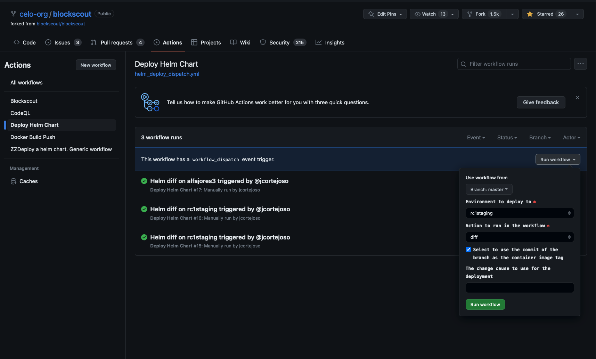

# Blockscout Helm Files

## Introduction

This directory contains the helm files used by cLabs to deploy Blockscout on Kubernetes.
Chart can be found at https://github.com/celo-org/charts/tree/main/charts/blockscout.

## How to upgrade the chart

To upgrade the chart, please refer to the chart [repository](https://github.com/celo-org/charts/tree/main/charts/blockscout).
Remind to update the chart version in the `Chart.yaml` file when chaning the chart.
The version will be published automatically when merging to the main branch.

## How to apply changes to any environment from GitHub Workflows

If you want to apply changes to any environment from GitHub Workflows, you need to update the relavant
values file in the [values](./values/) directory, and you may also need to update the helmfile in [helmfiles](./helmfiles/) directory.
Then, dispatch the workflow [Deploy Helm Chart](https://github.com/celo-org/blockscout/actions/workflows/helm_deploy_dispatch.yml) in the desired environment.
*Remember to run the workflow with `diff` action to check the changes before applying them.*

You can `diff` the changes from any branch under `celo-org/blockscout` repository, but you can only apply the changes from the `master` branch.

## How to apply changes to any environment from local machine

To apply changes to any environment from local machine, you need to have installed `helmfile` (`brew install helmfile`).
Also you need to have confugured your environment to access the relevant cluster (and have enough permissions)

Then, follow the next steps:

1. Move your `kubectl` context to the desired cluster
2. Update the relavant values file in the [values](./values/) directory, and you may also need to update the helmfile in [helmfiles](./helmfiles/) directory
3. Run `helmfile -f helmfiles/<environment>.yaml diff --color --context 5` to check the changes before applying them
4. Run `helmfile -f helmfiles/<environment>.yaml apply --color --context 5` to apply the changes
